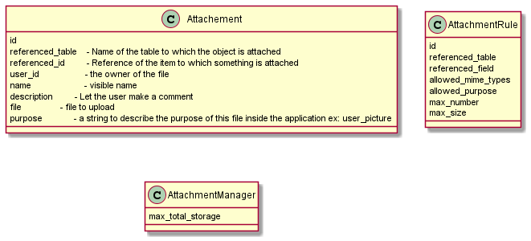

# Attachments

A file storage mechanism to attach files to elements of table.

## Use cases

As a user
* I want to store a picture of me in my profile (not really an attachment rather a file type in the model)
* I want to store the scan of a bill in an accounting application
* I want to upload a GPS track of a flight
* I want to download a file that I have uploaded or others files for which I have permission
* I want to replace a file that I have uploaded
* I want to delete a file that I have uploaded
* I want to see the list of attachments if there are several
* I do not want others user to be able to view my files.

As an admin
* I want to do what the users can do but for any user.
* I want to set limits to the total storage for a user

And later

* I want to use a smartphone application to upload pictures directly in the multi tenant WEB application.

## Requirements

* Download URL must be secured, it must not be possible to guess an url to retrieve something.

* It should be possible to attach a file to about anything identified by its table and id. I can attach a file to user 3 or to bill line 3482.

* It must be possible to attach several files to an item or to limit to a certain number.

* In some cases it will be possible to attach many files to an item in others cases only one file will be allowed for one purpose. For example a user picture, uploading another one will replace the previous one.

* It should be possible to control the file types and sizes to avoid that users saturate the storage or use it as personnal storage.

* In some case of general purpose storage it may be convenient to structure the storage into sub-directories. (or is it just the purpose?)

* It must be possible to backup and restore the storage per tenant.

## Design

 

## Implementation hints

It is relatively simple to attach files to items in table with big integer primary keys. But primary keys may be string or even more complex indexes, like the concatenation of a date field plus a foreign key ...

Let's limit the feature to table with integer key to start (most of the cases, and may be that the limitation is acceptable).

Referenced_table, referenced_id, user_id and purpose are defined by the application, the others attributes are defined by the user. 
Is it possible to manage that as a set of hidden attributes ? Is it safe ? or should the validation also check that the hidden fields have not been tampered ?

There are cases in which it is legitimate to let to the user the full control on the uploaded files t. In other cases these files may be supporting documents (expense bills, etc.) 
It could be managed in several ways:
* changing the ownership of the files once they have been uploaded making them belong to accounting. It would prevent the user to see them or download them back.
* Have a non_editable attribute for attachment and check it.
* Use the onDelete and onUpdate restrict mechanism to prevent it to happen. It would require a table to reference the frozen attachment (a table named registered_attachements or frozen_attachements with a attachement_id foreign key). Likely a robust approach.

