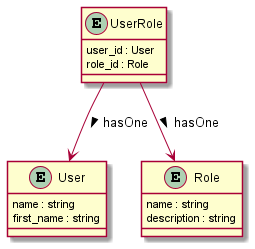

# Plantuml

Plantuml is a tool to generate Unified Modeling Language diagrams. It is a text based tool. You start by describing your diagram into a simple text file and it takes care of the drawing.

It is not a full modeling tool, but it is easy to use and the ratio between the learning curve and the quality of the result is rather good. 

[PlantUML site](https://plantuml.com)

[UML tutorial](https://sparxsystems.com/resources/tutorials/uml/part1.html)

## Using it in Eclipse

Once the plugin is installed in Eclipse, just open the file with the UML diagram description and open the PlanuUML view to see the generated diagram.

## Using it On Windows

Double click to the planuml.jar. It opens a windows in which you will be able to select your work directory. Plantuml then scan this directory to generate one png file for each text description.

Then the diagram can be used in the md documentation.

 